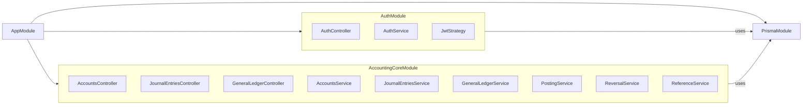
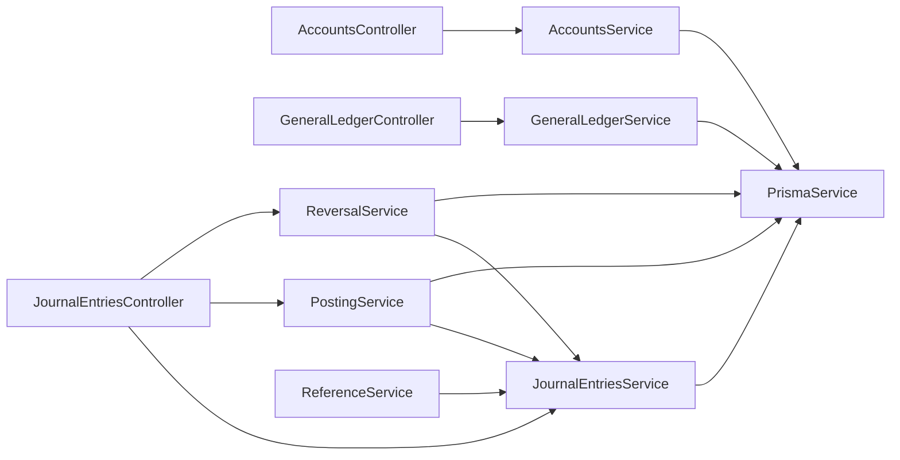
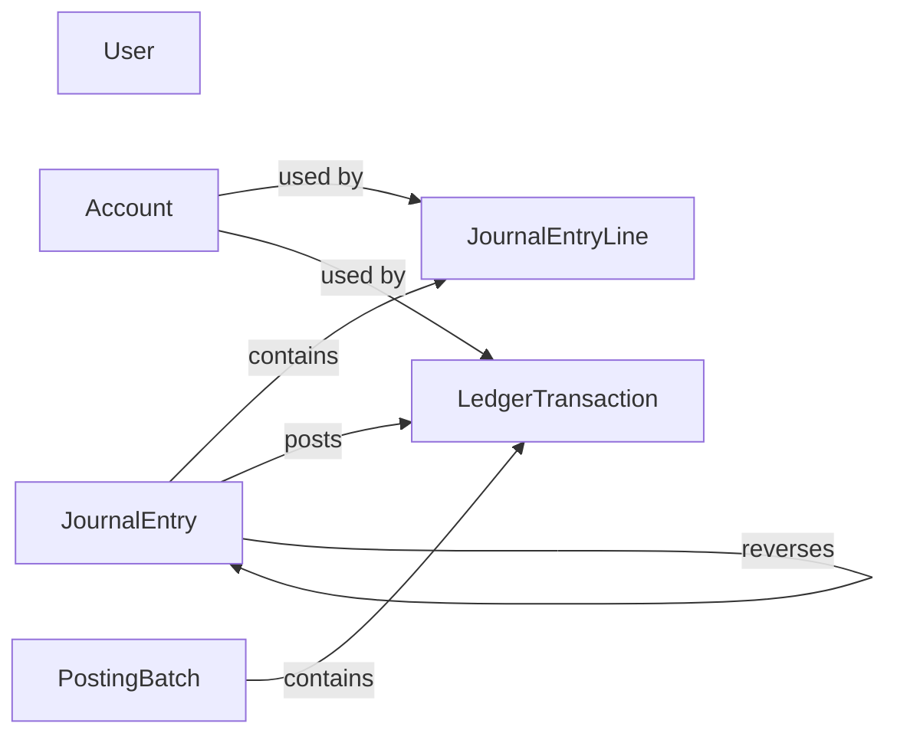

# Backend Architecture

> Note: The diagrams in this document use Mermaid syntax. To view them correctly in VS Code, install a Mermaid-compatible Markdown preview extension such as `Markdown Preview Mermaid Support`.
> If diagrams still render as text, use GitHub preview or Mermaid Live Editor at https://mermaid.live.

This document explains the **NestJS backend** for the `simple-account` project, focusing on module structure, routes, services, core flows, and database entities.

---

## 1. Backend Overview

The backend is implemented as a **modular monolith** using NestJS.

- `backend/src/app.module.ts` bootstraps the application.
- `PrismaModule` provides the shared database client.
- `AuthModule` handles user registration and login.
- `AccountingCoreModule` provides core accounting functionality.

The backend communicates with the database via **Prisma** and exposes HTTP APIs consumed by the frontend.

---

## 2. Module Structure

### `AppModule`

The application root imports:

- `PrismaModule`
- `AccountingCoreModule`
- `AuthModule`

### `PrismaModule`

Located in `backend/src/common/prisma/`.

- Provides a shared `PrismaService`.
- Connects NestJS application to `PostgreSQL`.
- Ensures request handlers can perform transactions and CRUD operations.

---

## 3. Authentication Module

### `AuthModule`

Located in `backend/src/modules/auth/`.

- `AuthController` handles HTTP endpoints.
- `AuthService` implements registration and login.
- `JwtStrategy` enforces JWT verification.

### Auth routes

- `POST /auth/register`
  - Creates a new user.
  - Hashes the password with `bcrypt`.
  - Returns user data without password.

- `POST /auth/login`
  - Validates credentials.
  - Returns an access token (`JWT`) and user details.

### Auth behavior

- Uses `PrismaService` to query the `User` table.
- On registration, prevents duplicate emails.
- On login, checks password and issues JWT payload:
  - `sub` (user id)
  - `email`
  - `role`

---

## 4. Accounting Core Module

Located in `backend/src/modules/accounting-core/`.

The accounting core exposes the following controllers and services.

### Controllers

- `AccountsController` → account CRUD and hierarchy
- `JournalEntriesController` → journal entry lifecycle
- `GeneralLedgerController` → ledger reporting and transaction detail

### Services

- `AccountsService` → create, update, list, hierarchy, deactivate
- `JournalEntriesService` → create, update, query, and validate journal entries
- `GeneralLedgerService` → query ledger and transaction details
- `PostingService` → post a journal entry to ledger
- `ReversalService` → reverse a posted journal entry
- `ReferenceService` → generate journal entry references

### Accounting core module diagram

---

## 5. Controller routes and operations

### `AccountsController`

Routes:

- `POST /accounts`
  - Create a new account record.
- `GET /accounts`
  - List accounts with optional filters: `type`, `isActive`, `search`.
- `GET /accounts/hierarchy/tree`
  - Return account tree data grouped by parent relationships.
- `GET /accounts/:id`
  - Retrieve a single account.
- `PATCH /accounts/:id`
  - Update account details.
- `POST /accounts/:id/deactivate`
  - Mark account as inactive.

### `JournalEntriesController`

Routes:

- `POST /journal-entries`
  - Create a new journal entry in draft state.
- `GET /journal-entries`
  - List entries filtered by `status`, `dateFrom`, `dateTo`, `reference`.
- `GET /journal-entries/:id`
  - Retrieve one journal entry with its lines.
- `PATCH /journal-entries/:id`
  - Update a draft journal entry.
- `POST /journal-entries/:id/post`
  - Post a journal entry to ledger.
- `POST /journal-entries/:id/reverse`
  - Reverse a posted journal entry.

### `GeneralLedgerController`

Routes:

- `GET /general-ledger`
  - List ledger transactions with reporting filters.
- `GET /general-ledger/:id`
  - Get a ledger transaction detail.

---

## 6. Core backend flows

### A. Create a journal entry

1. Frontend sends `POST /journal-entries`.
2. `JournalEntriesController.create()` receives the data.
3. `JournalEntriesService.create()` runs:
   - `validateLines()` ensures at least two lines and balanced debits/credits.
   - `ensureAccountsAreActive()` checks referenced accounts are active.
   - Creates `JournalEntry` and associated `JournalEntryLine` records.
   - Generates a reference using `ReferenceService`.
4. Returns the created journal entry.

### B. Update a journal entry

1. Frontend sends `PATCH /journal-entries/:id`.
2. `JournalEntriesController.update()` forwards to service.
3. `JournalEntriesService.update()` ensures entry is still `DRAFT`.
4. If lines change, it deletes old lines and creates new ones inside a transaction.
5. Returns updated entry.

### C. Post a journal entry

1. Frontend sends `POST /journal-entries/:id/post`.
2. `PostingService.post()` executes inside a transaction.
3. It loads the entry and validates draft status.
4. It validates each account is active.
5. Creates a `PostingBatch`.
6. Writes `LedgerTransaction` lines.
7. Updates account balances.
8. Marks the `JournalEntry` as `POSTED`.

### D. Reverse a journal entry

1. Frontend sends `POST /journal-entries/:id/reverse`.
2. `ReversalService.reverse()` loads the original entry.
3. Ensures the entry is `POSTED` and not already reversed.
4. Creates a reversal journal entry with inverted debit/credit values.
5. Creates a new `PostingBatch` and `LedgerTransaction` records.
6. Updates account balances again.
7. Returns the reversal entry.

### E. Query general ledger

1. Frontend sends `GET /general-ledger` or `GET /general-ledger/:id`.
2. `GeneralLedgerController` forwards to service.
3. `GeneralLedgerService` queries ledger transactions from the database.
4. Returns transaction list or transaction detail.

---

## 7. Journal entry lifecycle diagram

```mermaid
graph LR
  Create[Create Draft Entry]
  Validate[Validate Lines & Accounts]
  Save[Save JournalEntry + Lines]
  Post[Post Entry]
  Batch[Create PostingBatch]
  Ledger[Create LedgerTransaction lines]
  Balance[Update Account Balances]
  Complete[Mark as POSTED]
  Reverse[Reverse Entry]
  ReverseEntry[Create Reversal JournalEntry]
  ReverseLedger[Create Reversal LedgerTransaction lines]

  Create --> Validate --> Save --> Post --> Batch --> Ledger --> Balance --> Complete
  Complete --> Reverse --> ReverseEntry --> ReverseLedger --> Balance
```

---

## 8. Database entities

The backend uses `backend/prisma/schema.prisma`.

### Main entities

- `User` — authentication users
- `Account` — accounting chart of accounts
- `JournalEntry` — transaction header
- `JournalEntryLine` — debit/credit lines
- `PostingBatch` — batch of posted entries
- `LedgerTransaction` — ledger-level posted movements

### Entity relationship diagram

---

## 9. How the backend file tree maps to functionality

- `backend/src/app.module.ts`
  - Root module that imports all feature modules.

- `backend/src/common/prisma/prisma.module.ts`
  - Database provider module.

- `backend/src/modules/auth/`
  - Authentication and JWT handling.

- `backend/src/modules/accounting-core/`
  - Core accounting logic and API endpoints.

- `backend/prisma/schema.prisma`
  - Data model definitions for accounts, journal entries, ledger, and users.

---

## 10. Reading guide

If you want to understand the backend quickly:

1. Start with `backend/src/app.module.ts` to see the module imports.
2. Read `backend/src/modules/auth/auth.controller.ts` and `auth.service.ts` for login/register flow.
3. Read `backend/src/modules/accounting-core/journal-entries/journal-entries.controller.ts` and `journal-entries.service.ts` for transaction creation.
4. Read `backend/src/modules/accounting-core/posting/posting.service.ts` for posting rules.
5. Read `backend/src/modules/accounting-core/reversal/reversal.service.ts` for reverse-entry logic.
6. Inspect `backend/prisma/schema.prisma` for the database model.

---

## 11. Next steps

- Use this file as a reference when extending backend APIs.
- Add new modules under `backend/src/modules/` for future functional areas.
- Keep route and service responsibilities aligned with the current module structure.
