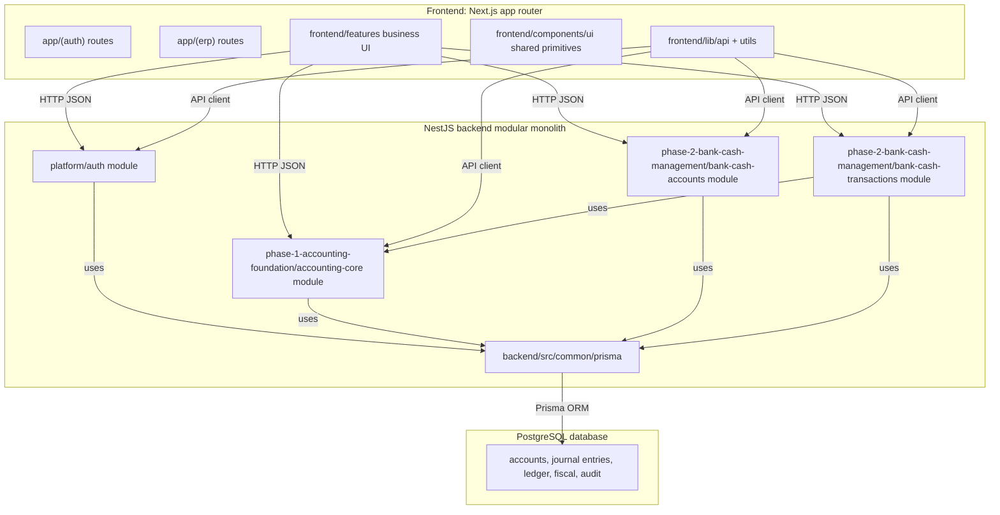

# System Structure Report

**Scope:** Phase 1 Accounting Foundation, Phase 2 Bank & Cash Management, and `platform/auth`.

A concise description of the current system shape for architecture review, handoff, or engineering status updates.

## Runtime stack

### Frontend

| Technology          | Purpose                                                    |
| ------------------- | ---------------------------------------------------------- |
| **Next.js**         | React framework with built-in routing, SSR, and API routes |
| **TypeScript**      | Type-safe development for fewer runtime errors             |
| **Tailwind CSS**    | Utility-first styling for rapid UI development             |
| **shadcn/ui**       | High-quality, accessible component library                 |
| **TanStack Query**  | Server state management and data fetching                  |
| **React Hook Form** | Performant form handling with minimal re-renders           |
| **Zod**             | Runtime schema validation for type safety                  |
### Backend

| Technology     | Purpose                                       |
| -------------- | --------------------------------------------- |
| **Node.js**    | JavaScript runtime environment                |
| **NestJS**     | Opinionated, scalable backend framework       |
| **TypeScript** | Consistent typing across frontend and backend |
| **Prisma ORM** | Type-safe database access and migrations      |


### Database

| Technology     | Purpose                    |
| -------------- | -------------------------- |
| **PostgreSQL** | Relational database engine |

### Authentication & Security

| Feature          | Implementation                   |
| ---------------- | -------------------------------- |
| Access Tokens    | JWT (short-lived)                |
| Refresh Tokens   | Secure refresh mechanism         |
| Password Hashing | bcrypt with salt rounds          |
| Authorization    | Role-based access control (RBAC) |
## Logical architecture

This system is organized as a **modular monolith** with a clear frontend / backend / database separation.



**Dependency rules**
- Accounting controllers use `JwtAuthGuard`.
- Frontend calls backend APIs only through `frontend/lib/api`.
- Backend modules use shared Prisma access in `backend/src/common/prisma`.

## Ownership boundaries

- `frontend/app` — route entrypoints, layouts, page composition
- `frontend/features` — business feature UI and accounting pages
- `frontend/components/ui` — reusable visual primitives and shared widgets
- `frontend/lib` — API client, config, utilities, storage helpers
- `backend/src/common/prisma` — shared Prisma client and DB wiring
- `backend/src/modules/platform/auth` — authentication, JWT, tenant context
- `backend/src/modules/phase-1-accounting-foundation/accounting-core` — accounting domain logic and controllers
- `backend/src/modules/phase-2-bank-cash-management/bank-cash-accounts` — bank/cash operational registry
- `backend/src/modules/phase-2-bank-cash-management/bank-cash-transactions` — receipt, payment, and transfer workflow records that post through accounting journals

## Request flow example

1. Browser opens `/journal-entries`
2. Frontend page uses `frontend/lib/api` to call backend
3. Backend controller handles request in `JournalEntriesController`
4. Service logic validates and posts via `PostingService`
5. Prisma commits accounting data to PostgreSQL

### Request flow diagram

```mermaid
flowchart LR
  Browser["Browser: /journal-entries"] -->|Load page| Frontend["Frontend page (ERP route)"]
  Frontend -->|Call API| ApiClient["frontend/lib/api HTTP/JSON client"]
  ApiClient -->|Request| Controller["JournalEntriesController"]
  Controller -->|Delegate| Service["PostingService / business logic"]
  Service -->|DB write| Prisma["Prisma shared DB access"]
  Prisma -->|Persist| Database["PostgreSQL accounting data"]
```



## Data model relationships

### Generated Prisma ERD

This ERD is generated directly from `backend/prisma/schema.prisma` using `prisma-erd-generator`.


### Key connection notes
- `Account.parentAccountId` creates account hierarchy.
- `BankCashAccount` links an operational bank/cash record to one posting `Account`.
- `BankCashTransaction` stores receipt, payment, and transfer drafts and links posted records to generated `JournalEntry` rows.
- `JournalEntryLine` links each journal line to its `JournalEntry` and `Account`.
- `LedgerTransaction` is the posted history row for a journal line and posting batch.
- `PostingBatch` groups posted ledger rows for a journal entry.
- `FiscalPeriod` and `FiscalYear` scope journal entries and ledger transactions.
- `SegmentValue` connects accounts and users to company/segment context.

## Repository layout

```text
simple-account/
├── docs/                          # Engineering handbook (source of truth)
├── frontend/
│   ├── app/
│   │   ├── (auth)/                # login, register
│   │   ├── (erp)/                 # ERP shell + thin page entrypoints
│   │   ├── layout.tsx, page.tsx, globals.css
│   ├── components/                # require-auth, site-header, ui/, forms
│   ├── features/
│   │   ├── auth/
│   │   ├── accounting/            # chart-of-accounts, journal-entries, general-ledger, fiscal, audit, master-data
│   │   └── phase-2-bank-cash-management/
│   │       └── bank-cash-accounts/
│   ├── lib/                       # api (client), config, utils, storage
│   └── providers/                 # app-providers, auth-provider, query-provider
└── backend/
    ├── prisma/
    └── src/
        ├── common/prisma/
        ├── app.module.ts
        └── modules/
            ├── platform/auth/
            └── phase-1-accounting-foundation/
                └── accounting-core/   # Phase 1 Nest submodules
            └── phase-2-bank-cash-management/
                └── bank-cash-accounts/
```


### Repository ownership

```mermaid
flowchart TB
  subgraph Repo["Repository Structure"]
    direction TB
    A["frontend/"]
    B["backend/"]
    C["docs/"]
  end

  subgraph FrontendOwnership["Frontend Ownership"]
    direction TB
    A1["app/: route entrypoints and layouts"]
    A2["features/: business feature UI"]
    A3["components/ui/: reusable UI primitives"]
    A4["lib/: API client, config, utils"]
    A5["providers/: auth and query providers"]
  end

  subgraph BackendOwnership["Backend Ownership"]
    direction TB
    B1["src/common/prisma: shared Prisma DB client"]
    B2["src/modules/platform/auth: auth, JWT, tenant context"]
    B3["src/modules/phase-1-accounting-foundation/accounting-core: accounting domain"]
  end

  subgraph DocsOwnership["Documentation"]
    direction TB
    C1["docs/system-design.md"]
    C2["docs/project-structure.md"]
    C3["docs/system-structure-report.md"]
  end

  A --> A1
  A --> A2
  A --> A3
  A --> A4
  A --> A5

  B --> B1
  B --> B2
  B --> B3

  C --> C1
  C --> C2
  C --> C3
```




`JournalEntriesController` is registered on `AccountingCoreModule` (in addition to feature modules’ own controllers).
